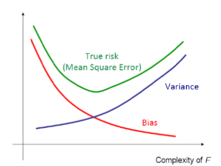

## Introduction

Zusammenfassung der Vorlesung _Maschinelles Lernen -- Grundverfahren_ von Prof. Gerhard Neumann im Wintersemester 2020/2021 am Karlsruher Institut für Technologie.

## Basics

- Supervised Learning: Training data includes targets / labels
  - Regression: Learn continuos function
  - Classification: Learn (discrete) class labels
- Unsupervised Learning: Training data does _not_ include labels
  - Model the data
  - Clustering (k-means)
  - Dimensionality reduction (PCA)

### Linear Algebra

- inner / outer product
- Matrix calculus: $\nabla_x f(x) := \frac{\partial f(x)}{\partial x}$
  - $\nabla_x x^T x = 2x$
  - $\nabla_x x^T A x = 2 A x$

### Probability Theory

- random variable $X$, $p(x)$ is the probability of $X$ to be $x$
- $p(x)$ is the density function
- joint distribution $p(x,y)$: probability of $x$ _and_ $y$
- conditional distribution $p(x|y)$: probability of x given y
- sum rule: $p(x) = \sum_y p(x,y)$
- chain rule: $p(x,y)$ = p(x|y) p(y)
- Bayes rule: $p(x|y) = \frac{p(y|x)p(x)}{p(y)}$ _very important_
- Expectation of a function $f$ with distribution $p$: $\mathbb{E}_p(f(x)) = \int p(x)f(x)dx$
- Monte-carlo estimation: $\mathbb{E}_p (f(x)) = 1/N \sum_{x_i \sim p(x)} f(x_i)$ _approximate by samples_
- Distributions: Bernoulli, Gaussian

### Maximum Likelihood Estimation

- find parameter $\theta$ for $p_\theta$
- Data $x$ given with labels $y$
- Fitness of $p_\theta$: $\prod_i p_\theta(x_i,y_i)$ _higher = better_
- product is hard to differentiate, take $\log$ to make it a sum
- also works for conditional distributions (supervised learning)
- MLE $\Leftrightarrow$ SSE for conditional gaussian models with constant noise
  
## Linear Regression

- fit a line: $y = f(x) + \epsilon = w_0 + w_1 x + \epsilon$ with $\epsilon \sim N(0,1)$ being Gaussian noise
- objective: minimize sum of squared error: $\text{SSE} = \sum_i^N (y_i - f(x_i))^2$
- this estimates the mean of the target function: $f(x) = \mathbb{E}(y | x)$
- Matrix form: $\text{SSE} = (y - X w)^T (y - X w)$
- $\nabla_w \text{SSE} = 0$ yields a closed form solution: $w^* = (X^T X)^{-1}X^T y$
- solution available because quadratic in weights (convex, differentiable)

### Quality of the model

- R-square determines how much of the total variation in $y$ is explained by the variation in $x$

### Generalized Linear Regression

- Polynomial curve fitting: $f(x) = \Phi(x)^T w$ with $\Phi(x)^T = (1, x, x^2, x^3)$
- there is a closed form solution for optimal $w^*$
- any linear closed form solution can be learned if we know suitable basis function (which we don't)

### Polynomial overfitting

- high order $\Rightarrow$ Overfitting (strong oscillation)
- error on the _training set_ is not an indication for a good fit $\Rightarrow$ need independent _test set_

### Regularization

- prevent overfitting by forcing small weights
  - cost function: data term + regularization term, $E_D(w) + \lambda E_W(w)$
  - $\lambda$ is _regularization factor_, often needs manual tuning (strong underfitting / no effect possible)
  - Ridge regression (for SSE): $\lambda E_W(w) = \lambda w^T w$
    - optimal solution: $w^*_\text{ridge} = (\Phi^T \Phi + \lambda I)^{-1}\Phi^T y$

## Linear Classification

- Generative Models (c$\mapsto$x)
  - assume class prior $p(c)$ and class density $p(x|c)$
  - predict by computing posterior $p(c|x)$ with Bayes rule
  - assumptions, e.g. Gaussian, can introduce big errors
- Discriminative Models (c$\mapsto$x)
  - estimate parameters of $p(c|x)$ from training data
  - simpler than generative models

- Binary classifier $f(x_i) = \begin{cases}>0 &\text{if } y_i = 1 \\ <0 & \text{if } y_i = 0\end{cases}$
- Linear classifier: $f(x) = w^Tx+b$
  - $w$ is normal to the discrimative hyperplane, $b$ is bias
- not all data is linear separable (e.g. two moons)

### Loss functions

- 01-loss (step function) is NP-hard to optimize
- SSE is not robust to outliers
- sigmoid $\sigma(x) = 1 / (1+e^{-x})$ _squishifier_
  - probabilistic view: $p(c=1|x) = \sigma(w^Tx+b)$
  - $p(c|x) = p(c=1|x)^c p(c=0|x)^{1-c}$
  - do log-likelihood with the above $\rightarrow$ _cross-entropy loss_
  - optimizing cross-entropy loss is called _logistic regression_ (is still convex)
  - no closed form solution but there is _gradient descent_

- use feature space to transform input space into a linear separable problem, _Generalized Logistic Models_

- Regularization: regularization penalty, e.g. $||w||^2$

### Gradient Descent

- finds a minimum (not necessarily the global minimum unless convex)
- $x_{t+1} = x_t - \eta \nabla f(x_t)$, $\eta$ is the the learning rate, gradient points in the direction of steepest ascent
- choose a good $\eta$, or the algorithm will not converge or be very slow
- when to terminate: small gradient, small change in function value, fixed number of steps (time, budget)

- _stochastic gradient descent_: don't use all training data, just a random sample
  - struggles to find the exact optimum (drunk man down the hill)
  - batch gradients require more (redundant computation)
  - mini-batches are good for GPU computation

- diminishing step size, e.g. $\eta_t = 1/t$
  - if $\sum_t \eta_t$ does not converge but $\sum_t \eta_t^2$ does

### Multi-class Classification

- softmax: $p(c=i|x) = \frac{\exp(w_i^T\Phi(x))}{\sum_k \exp(w_k^T\Phi(x))}$
  - each class gets a weight vector
  - if only two classes choose sigmoid
- as conditional multinomial distribution: $p(c|x) = \prod_k p(c=k|x)^{h_{c,k}}$
  - use log-likelihood and gradient descent

## Model Selection

- true (random test point) risk vs. empirical (test set) risk
- too complex model $\Rightarrow$ overfitting
  - unexpected behavior in between training points
  - training error goes down, validation error goes up
- too simple model $\Rightarrow$ underfitting
  - both training and validation error high
- true risk is u-shaped over the complexity
- Bias-Variance Decomposition
  - Expected Loss = Variance + Bias² + Noise
  - Bias due to restriction of model class (_structure error_)
  - Variance due to randomness of the data set
  - 

### Evaluation Methods

- Hold-out method
  - split in training and validation
  - choose model with best performance on validation
  - "unlucky" splits cause misleading results
- k-fold cross validation
  - creates k predictors for each model class
  - Leave-One-Out: k = size of the data set (validate with 1 sample)
  - random sub-sampling: just take some samples for validation

### Regularization techniques

- Occam's Razor: prefer simpler explanations over complex ones
- Limit model complexity (neurons, leaves, polynomial order, ...)
- regularization penalty
  - small parameters $\Rightarrow$ smoother function estimate
  - $L_2, L_1$ penalty
- early stopping
  - do not push the model too much
  - use validation error to decide when to stop
  - efficient / simple but needs validation data
  - similar effect as $L_2$
- Noise
  - add noise to the inputs $\Rightarrow$ rules out non-robust solutions
  - equivalent to $L_2$ for linear regression
- Data Augmentation
  - create additional samples (flip, rotate, crop, ...)

## Trees and Forests

### k-Nearest-Neighbor

- kNN is a non-parametric (_instance-based_) methods, i.e. stores all training data and use these for predictions
  - fast / no training
  - complexity adapts to training input
  - slow prediction
  - bad at high-dim input
- kNN: find k nearest neighbors and return "average" of these
- decision boundary ~ Voronoi diagram
- choose k by cross-validation (small k $\Rightarrow$ overfitting)
- metrics: euclidean, cosine, hamming, manhattan, Mahalanobis
- performance of kNN degrades with more (irrelevant) dimensions
- curse of dimensionality
  - in high dimensions most points are far away from the origin
  - most points are equally far away from each other $\Rightarrow$ neighborhood is hard to calculate
  - remedies: feature selection, dimensionality reduction
- KD-trees to find the neighbors
  - _build_: choose axis, split at median, repeat until only leafs
  - _search_: find region containing x, then move up recursively to extend neighborhood

### Classification & Regression Trees

- nodes are (binary) splitting criterions
  - in regression: return average of the node
    - left / right split with residual sum of squares (RSS)
  - in classification: majority vote
    - left / right split with minimum entropy in subtrees
- when to stop splitting? minimum number of samples per node or maximum depth reached
- small number of samples per leaf $\Rightarrow$ sensitive to noise
- easy but not too accurate and instable

### Random forests

- use average of multiple trees to improve accuracy
- randomization: grow some trees
  - at each node: select some samples and do the split
  - effect: increased variability of the single trees, a tree is less likely to over-specialize, all trees are less likely to overfit
- Random forest is a good ML method but not easy to interpret

## Dimensionality Reduction

### Linear Dimensionality Reduction

- Goal: minimize loss when projecting data points to lower dimension
- Notation: original data $x_i \in \mathbb{R}^D$, representation $z_i \in \mathbb{R}^M$ with mapping $W \in \mathbb{R}^{M \times D}$: $z = Wx$ (Zeilen von $W$: $u_i$'s, orthonormal)
- Reproduction: $x \approx W^T z$
- Loss: squared reproduction error (equiv.: variance of projection, after zero-mean)

- How: PCA (Principle Component Analysis)
  - idea: first principal dimension is direction of maximal variance (biggest Eigenvector of $\Sigma$), solve constraint optimization: $u_1 = \min_u u^T\Sigma u$ so that $u^T u = 1$)
  - zero-mean data
  - compute covariance matrix
  - choose first M largest Eigenvalues
- How to choose dimension?
  - based of application performance or so that some fraction of the variance is covered
- Applications: lower dimension and find more natural coordinate system, ``capture the essence''

### Constraint Optimization (Lagrangian Multipliers)

- $\min_x f(x) \text{ so that } foo \geq 0$: lagrangian $= f(x) - \lambda (foo)$.
- optimization: $\min_x \max_\lambda L(x,\lambda)$, $\lambda > 0$
- slatters condition: convex objective and convex constraints, dual is equivalent:
  - dual: $\lambda^* = \max_\lambda \min_x L(x, \lambda)$ 
  - then $x^* = \min_x L(x, \lambda^*)$

## Clustering

- Goal: find structure in data
- need a distance measure / metric

### Hierarchical Clustering: Dentogram

- Tree, similarity = height of lowest common node
- Properties:
  - find number of clusters
  - detecting outliers
- Construction:
  - bottom-up: merge ``closest'' clusters
    - single linkage: minimum distance of points
    - complete linkage: maximum distance of points
    - average linkage
    - centroid linkage
  - (top-down)

- intuitive, but costly

### Flat Clustering: K-Means

- Goal: minimize sum of squared distances
- Algorithm:
  - Pick k, place k ``cluster centers'' random or using Furthest First Initialisation:
    - first center random data point
    - other centers at data point with max. min. distance from placed centers
  - Assign each sample to its closest centroid
  - put ``cluster centers'' on mean of the samples assigned to them
- Convergence: (locally) minimizes the sum of squared differences - BUT: only local minimum
  - try multiple initializations
- Choose k: "knee-finding method" using plot of SSD of result
- quick, but needs metric, can't handle outliers, noise or non-convex shapes

## Density Estimation

- Applications: Classify (generative approaches), Outlier, Generate new data

### Parametric Density Estimation

- for example Gaussian distribution, use MLE.

### Non-Parametric Density Estimation

- Histogram: Discretize input space into bins, count samples per bin.
  - general, brute force, but curse of dimensionality problem
- Kernel Density Estimation ($V \rightarrow K$)
  - ``count data points in kernel'' around input point: $K(x_*) = \sum_{i=1}^N{g(x_*-x_i)}$
  - Estimated density: $p(x_*) \approx \frac{K(x_*)}{NV}$
  - Parzen Window: d-dim. Hypercube, edge length h: simple but not smooth
  - Gaussian Kernel: smooth but expensive
- K-nearest neighbor ($K \rightarrow V$)
  - find out min. radius of kernel (sphere, ...) so that K data points inside
- Hyperparameter! (bin size / kernel bandwidth / K) $\rightarrow$ use Cross-validation.

### Mixture Models

- Idea: Weighted sum of individual distributions.
- GMM (Gaussian Mixture Model) parameters: coefficients (``weights''), means, variances
- Gradient Descent not efficient $\Rightarrow$ use **EM**

## Expectation Maximization

- Goal: estimate latent variable models (GMM, ...)
- Kullback-Leibler Divergence: similarity measure for distributions (0, iff distributions are the same).
- marginal log-like = Lower Bound + KL Divergence.
- Algorithm:
  1. E: find q(z) that minimizes KL: $q(z) = p(z~|~x, \theta_{old})$ (Lower Bound goes up)
  1. M: maximize lower bound (maximize $\theta$): increases likelihood
- Notes:
  - we assume that E-Step can set KL to zero. Only possible if z is discrete or we have linear Gaussian models.
  - more complex models (Deep NNs,...): Extension of EM: Variational Bayes / Variational Inference

### EM for GMM

- E: Compute responsibilities $q_{ik} = p(z=k|x_i)$
- M: Update $\theta$:
  - Update coefficients of components using responsibilities: $\pi_k = \frac{\sum_i q_{ik}}{N}$
  - Update components independently:
    - $\mu_k = \frac{\sum_i q_{ik} x_i}{\sum_i q_{ik}}$, $\Sigma_k = \frac{\sum_i q_{ik} (x_i - \mu_k)(x_i - \mu_k)^T}{\sum_i q_{ik}}$

- K-means is special case of EM: Co-variances $\approx0$, responsibilities $q_{ik}$ of nearest cluster 1, others 0
- K-means is used to init. means of EM. EM is more expensive but also yields means, variances.
- number of components: model-selection problem.

### EM for PCA

- Latent variables: for each data point $x$, the representation $z$ in **low-d space (latent space)** as a Gauß-Distribution and samples of $z$.
- Parameters: $W$ (projection to low-d.) and $\mu$.
- Expectation: Compute mean and covariance of $z_i$'s, Generate latent samples.
- Maximization: Update $W$, $\mu$ and $\sigma^2$ (like linear regression):
  - $\left[\begin{array}{c} \mu \\ W \end{array}\right]=\left(Z^{T} Z\right)^{-1} Z^{T} X$

## Kernel Methods
### (Positive Definite) Kernels
- comparison function $k$ of two points, symmetric.
- Kernel Matrix $K \in \mathbb{R}^{n \times n}$ (Similarity matrix): $[K]_{ij} = k(x_i, x_j($)$
- math stuff:
  - $k$ is positive definite $\Rightarrow$ K$ is spd (symmetric positive definite)
  - mapping $\phi$ to a feature space $\Rightarrow$ $k(x,x') = \langle \phi(x),\phi(x')\rangle$ is a positive definite kernel.
  - $k$ positive definite $\Rightarrow$ $\exists$ feature space, mapping $\phi$, so that $k$ is as above.
  - Let $\Phi_X$ ``rows: $\theta(x_i)^T$''
    - $K = \Phi_X \Phi_X^T$
    - define $k(x^*) = \Phi_X \theta(x^*)$
- Examples:
  - linear kernel: $k$ is scalar product
  - polynomial kernel: $k(x,x') = \langle x, x'\rangle^d$
  - **Gaussian Kernel**: $k(x, y)=\exp \left(-\frac{\|x-y\|^{2}}{2 \sigma^{2}}\right)$
    - most used kernel, can be written as inner product of 2 infinite dim. feature vectors,
    - mapping ($\mu$): $\phi_{\mu} (x) = 1/Z \exp \left(-\frac{\|x-\mu\|^{2}}{4 \sigma^{2}}\right)$

### Kernel Trick

- _kernel methods_ are algorithms that take $K$ as input
- Kernels can be used for all feature based algorithms that can be rewritten such that they contain inner products of feature vectors (aka kernel trick)
- kernels can store the data in an _infinite dim feature space_
  - just save the dot product, not the infinite dim feature
- this is a _more powerful representation_ than linear features

### Kernel Ridge Regression

- $f^*(x) = k(x)^T (K + \lambda I)^{-1} y$
- use Gaussian Kernel, hyperparameters: sigma.
- Fazit: flexible representation, few hyperparameters BUT expensive (inverse, store all samples).

## Support Vector Machines

- Support Vectors: Data points closest to decision boundary (i.e. in linear classification)
- Note: Classes are called positive and negative
- Goal: **maximize margin** (min. dist. between decision boundary and Support Vectors)
  - Distance: $w^Tx+b$
  - Condition: $y_i(w^Tx+b) \geq 1$.
  - Margin is $\frac{2}{\|w\|}$ $\Rightarrow$ Quadratic Opt. Problem: minimize $\|w\|^2$
- Variant Soft Max-Margin: slack-variables $\xi \geq 0$ allow violation of margin: $y_i(w^Tx_i+b) \geq 1-\xi_i$
  - punish slack variables: minimize ${\|w\|}^2 + C \sum_i^N\xi_i$
- Hinge Loss: replace $\xi_i$ with $\max(0, 1-y_i f(x_i))$ (``loss function'' is 0 for correct classification!)
  - not differentiable $\Rightarrow$ use **Sub-Gradient Descent** (see slides, not covered here)
- Compare to LR: more balanced boundary, less sensitive to outliers

### SVMs with Kernels

- Formulate SVM with features: conditions now $y_i(w^T\theta(x_i) + b) \geq 1$
- Lagrangian shit happens.
- Choosing C: Model Selection Problem. low C means small complexity.

## Bayesian Learning

## Neural Networks

## Conclusion

Thank you, `pandoc`!
